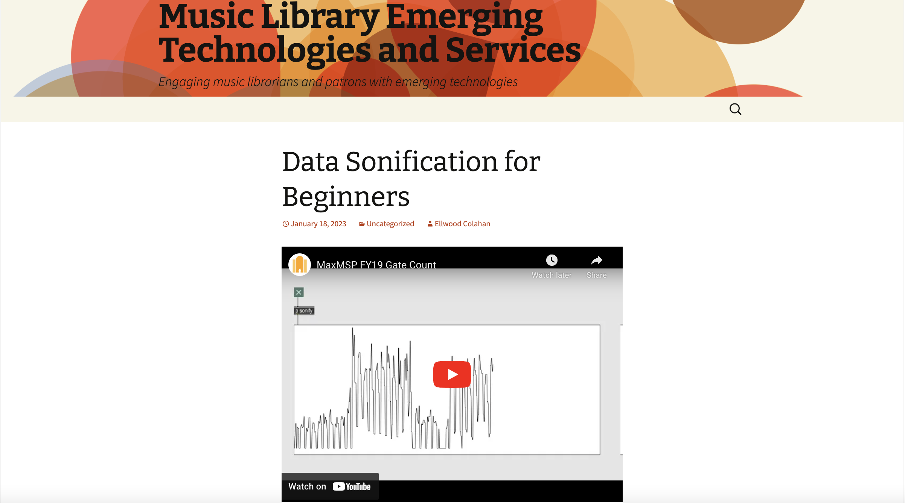
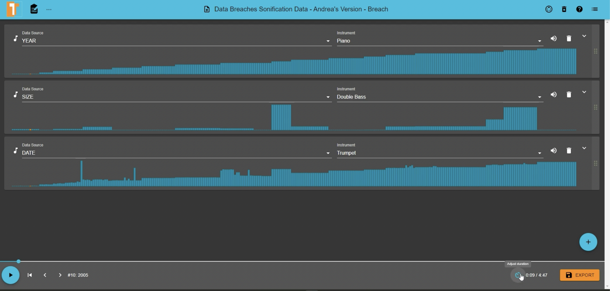
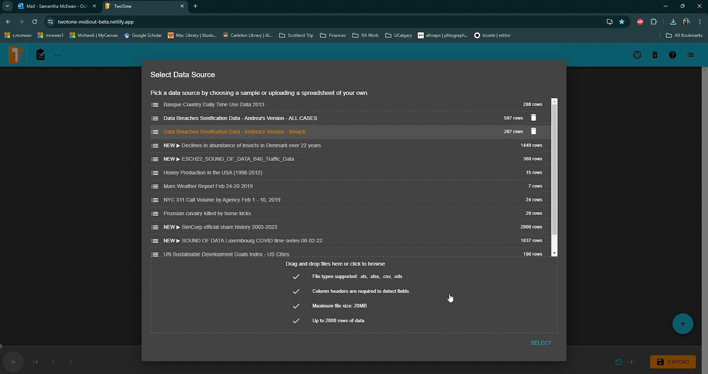
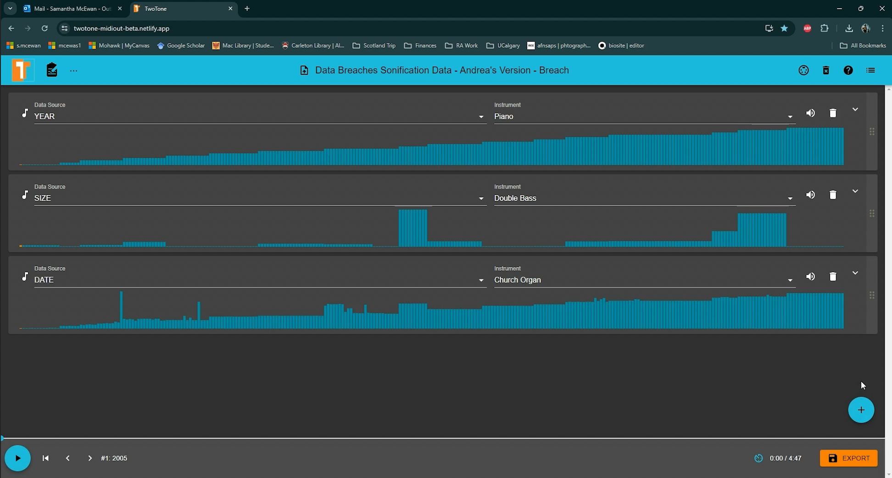

{: .no_toc}  
# Lesson 4 - Sonifying the Data

## Lesson Objectives
- Utilize sonification software effectively, choosing parameters that reflect the intended emotional and narrative impact of the data. 
- Perform initial data setup in sonification platforms, optimizing data for the tool’s features and user interface. 
- Manage and refine sonification projects through track creation, audio layering, and tempo adjustments to achieve the desired auditory presentation. 
- Use advanced features in sonification tools to fine-tune the data’s sound, enhancing the overall quality and clarity of the sonification. 
- Ensure effective saving, exporting, and sharing of sonifications to maximize their impact and accessibility for intended audiences. 

## Choosing Tools and Software 

The tools you end up using to sonify your data will generally depend on if you have any previous experience with coding. The following Humanities Commons guide for beginners lists many tools that range from a <a href="https://mlaetsc.hcommons.org/2023/01/18/data-sonification-for-beginners/" target="_blank" rel="noopener noreferrer">low-high barrier for entry</a>. Other popular options include: Max/MSP, Pure Data, Audacity, Supercollider, Tone.js, ChucK, Estuary, etc. 

But let’s say you don’t have any coding experience. In that case, platforms like "Two-Tone" offer an easy introduction without requiring advanced programming skills. 

## Using Two-Tone 

Overview: Two-Tone is designed for simplicity, catering to beginners. The interface includes hints to assist users through its features, including advanced tools like the MIDI out feature. 

Note: For optimal experience, using Google Chrome is recommended. 

## Getting Started with Two-Tone 

Web App: Dive straight in by using the web application at <a href="http://sonify.io/twotone/" target="_blank" rel="noopener noreferrer">sonify.io/twotone/.</a>  For the best performance, we recommend using the Google Chrome web browser. 

Official Page: Check out the tool's features and updates at <a href="https://twotone.io/" target="_blank" rel="noopener noreferrer">twotone.io.</a> 

Documentation: If you're the type who loves details, TwoTone's <a href="https://github.com/sonifydata/twotone/" target="_blank" rel="noopener noreferrer">documentation</a> is comprehensive. 

## Upload Your Data 

Data Import: The software allows easy uploading and navigation of datasets, displaying a stacked view of each column with titles. When we started, we first uploaded our data breach dataset as a single excel spreadsheet, ensuring the .csv or .xlxs was readable. Note: TwoTone also offers sample spreadsheets if you just want to get a feel for the tool. 

Initial Setup: Begin by selecting a range of data for sonification. This choice influences the narrative and impact of the sonification. Consider the story you want the data to tell and the aspects you wish to emphasize or omit. 

## Choosing Parameters 

Two-Tone offers a range of parameters such as pitch, volume, rhythm, and tempo. The selection of these parameters should be aligned with the intended narrative and emotional impact of the data. Considerations for parameter mapping will depend on your specific needs, but in general the goal is to link specific data values to sound parameters. 

For our data, we organized and scored the breach discourse spreadsheets according to sections like “Breach year”, “month of coverage”, “perpetrator language”, “victim language”, etc.  

In order to parse out information about the language use and public coverage of the breaches rather than the breach data itself. This meant we had the option to assign different instruments to each element and could experiments with bringing out particular volumes in the mix (if we wanted to highlight perps vs victims for example, we could make everything else quiet or turn them off just to hear these two lines of sound).  

## Crafting Your Data's Sound

Basic steps involved: 

<iframe height="416" width="100%" allowfullscreen frameborder=0 src="https://echo360.ca/media/c9885dd2-c912-4f62-b5df-1a3f51275c6e/public"></iframe>
[View original here.](https://echo360.ca/media/c9885dd2-c912-4f62-b5df-1a3f51275c6e/public)

TwoTone lets you have multiple tracks, each representing different facets of your data. 

This allows you to sonify different types of data, such as dates & years, as well as your textual data (transformed into numerical representation). 

We added tracks by simply clicking the "+" button. TwoTone currently supports: 

Musical Scale: This transforms data values into musical notes. 

Generate Audio: TwoTone instantly creates an audio track from your data.  

Volume Control: Each track's volume can be adjusted, ensuring none overshadows the others, or if you want to bring out certain voices in the track. 

Mute or Delete: Use the speaker button to mute a track or the trash can icon to delete one (but remember, it's permanent!). 

Midi: TwoTone gives you the option of using the “Midi” feature to expand your sonification horizons. This option can be found at the top right of the module, right next to the delete and help buttons.  

Listen: Hit the "Play" button to hear your data come alive. 

## Fine-Tuning Your Creation 
 
<iframe height="416" width="100%" allowfullscreen frameborder=0 src="https://echo360.ca/media/b57fb946-39f5-4c82-80fa-a357fcad424c/public"></iframe>
[View original here.](https://echo360.ca/media/b57fb946-39f5-4c82-80fa-a357fcad424c/public)

Set the Pace: Control the duration, tempo, and even the time each row in your data gets with the "Adjust Duration" feature. 

Filtering: You can filter tracks to play sounds based on specific data values. This enabled intricate layering of sounds and rhythms.

## Saving and Sharing 

<iframe height="416" width="100%" allowfullscreen frameborder=0 src="https://echo360.ca/media/b57fb946-39f5-4c82-80fa-a357fcad424c/public"></iframe>
[View original here.](https://echo360.ca/media/b57fb946-39f5-4c82-80fa-a357fcad424c/public)

Export: TwoTone lets you save your project as an MP3 or Waveform (PCM). We found different bit rate options for MP3, ranging from 64 kbps to 320 kbps. 

Share: Find some hashtags or online organizations that might help you spread the word about your creation! 

## Other Tips & Tricks

Narration Audio: Perfect for adding voiceovers or background music. 

Re-ordering: Just drag a track's handle on the right to rearrange. 

Dive Deeper: TwoTone’s “Midi” feature allows you to create additional sounds using a program like <a href="https://www.bitwig.com/overview/" target="_blank" rel="noopener noreferrer">BitWig Studio</a> to expand your workflow, but will take some additional experimentation to learn what the program has to offer.

